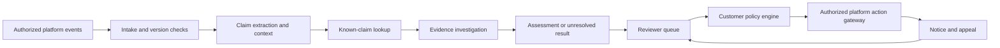

# Architecture and proposed contracts

Design only. The components and endpoints below are not implemented or deployed.

## Processing flow

The fact-checking workers never receive account-disable credentials. The evidence result, policy decision and execution receipt are distinct records. This boundary prevents a model's conclusion or a malicious post from directly becoming an account action.

## Deployment shape

Start with a small set of deployable services: API/reviewer application, background analysis workers and a sandboxed evidence fetcher. Use a transactional database for cases and decisions, a durable queue for jobs, and tenant-scoped object storage for permitted evidence. Add a search/vector index for claim matching; an embedding match must be verified before reuse. Avoid unnecessary service fragmentation in the prototype.

For production, provide container images and deployment configuration for the customer's cloud/VPC. Isolate tenants, keys, queues, indices and retention policies. Offer an outbound-network policy, approved model-provider list and customer-managed keys where required. A hosted pilot can be an option, but cloud neutrality does not itself establish that all security requirements are met.

Customer-supplied media objects should be accessed with scoped references. Do not assume arbitrary content URLs are safe to fetch or permission to send private text to a web search engine. Egress for private content requires a specific processing policy; otherwise use approved local evidence sources or return unresolved.

## Pipeline stages

1. **Intake:** verify tenant identity, signature and replay window; validate size/schema; persist before acknowledging; use an idempotency key. Assign received time separately from platform publication time.
2. **Versioning:** key by tenant/platform/content ID and revision. Out-of-order events cannot reactivate deleted content or apply a stale assessment. Retries must not create new strikes or duplicate labels.
3. **Context:** detect language; retain original text and translated spans if used; identify quoted/reposted claims, satire and commentary. Extract atomic claims with dates, geography, quantity and endorsement. Record OCR/transcription confidence as processing quality, not factual confidence.
4. **Reuse:** find potential known-claim matches; verify semantic equivalence, temporal scope and media context. Expire evidence caches and invalidate affected decisions when a source is corrected.
5. **Investigate:** retrieve primary records and credible corroboration, inspect actual passages, track provenance and contradictions. Do not force a rule that any two sources establish truth: copied stories are correlated, and a primary source can be incomplete or self-interested.
6. **Assess:** produce structured claim judgments with evidence IDs, explanation and gaps. Require a contradiction to support a contradicted verdict; lack of confirmation is insufficient. An evidence verifier checks that citations exist and support the stated proposition. Another model agreeing is not independent factual evidence.
7. **Review:** show the original post, exact claim spans, source context and differences between automatic assessment and the proposed policy action. Reviewers confirm, reject, defer or escalate; high-stakes cases go to specialists.
8. **Act:** after authorization and policy checks, issue a version-bound, idempotent action through the customer gateway. Store accepted/rejected/failed/unknown execution receipts. Timeout does not mean success; reconcile before retrying an uncertain action.
9. **Correct:** new evidence, edits and appeals create a new version, recompute affected incident counts and request reversals when appropriate. Deleted/private content follows retention and access rules across caches, indices and backups.

## Data model

| Record | Required information |
|---|---|
| Content event | Tenant, platform, event ID/type, content ID/version, author reference if verified, publication/receipt times, visibility, language, text/media references and authorized source |
| Claim | Exact span or media segment, normalized proposition, who/what/when/where, attribution, endorsement and relation to other claims |
| Evidence | Source URL/document ID, publisher, publication/retrieval times, passage/segment, permitted snapshot/hash, source lineage, claim relation and limitations |
| Assessment | Per-claim outcome, reason, evidence IDs, missing evidence, model/prompt/pipeline versions, assessed time, expiration/recheck trigger and calibrated score if available |
| Policy decision | Policy version, jurisdiction, rule, severity, reviewer identity, confirmed/rejected/pending status, exact content version and permitted action |
| Incident | Verified tenant-specific account reference, policy decision, canonical incident grouping, effective/expiry dates, eligibility and appeal state |
| Action receipt | Idempotency key, requested action, content/account scope, customer authorization, platform result and reversal relationship |

Do not describe a model's self-reported certainty as a calibrated probability. Store unavailable calibration as null and show evidence sufficiency separately. Avoid an opaque global user trust score.

## Proposed API

| Endpoint | Purpose |
|---|---|
| `POST /v1/content-events` | Create/edit/delete intake; returns a durable job receipt, not an instant truth judgment |
| `GET /v1/assessments/{id}` | Read an authorized assessment and its current/superseded status |
| `GET /v1/cases` | Scoped reviewer queue with pagination and explicit filters |
| `POST /v1/cases/{id}/decisions` | Authorized reviewer decision with optimistic version check |
| `POST /v1/cases/{id}/appeals` | Record new evidence/appeal and trigger independent review |
| `GET /v1/accounts/{reference}/incidents` | Authorized tenant-specific incident history; no cross-platform identity inference |
| `POST /v1/action-receipts` | Customer gateway reports confirmed action state |

Outgoing events can include `assessment.ready`, `assessment.revised`, `case.escalated`, `action.proposed` and `action.reversal_proposed`. Webhooks require signatures, retries, delivery IDs and a documented at-least-once contract. Webhook subscribers are configured by authorized admins, never by content supplied in a post.

See the [content event](../examples/content-event.json), [assessment](../examples/assessment.json) and [policy](../examples/policy.json) examples. They are fictional and intentionally review-only. Build a formal versioned schema/OpenAPI contract before external integration.

## Policy execution invariants

- A model flag cannot itself create an eligible strike.
- A second eligible incident creates an admin review case; a third can propose a restriction review. Counts are computed from active adjudicated records, not a mutable counter with no history.
- A pending appeal excludes the contested incident from new automatic escalation. An overturn invalidates its contribution and triggers reconciliation of downstream actions.
- The same replayed event/incident cannot count twice; similar-but-distinct incidents require a documented grouping decision.
- The author reference must be verified by the customer feed. A forwarded screenshot alone cannot identify a punishable originator.
- A stale content version, expired evidence or unsupported language cannot silently inherit a punitive decision.
- In shadow mode, all external actions are disabled. Changing mode requires an authorized configuration change recorded in the audit log.
- Suspension/disabling requires customer permission, applicable policy and human approval in the initial product. No universal provider token can disable arbitrary accounts on all networks.

## Reliability, security and operational concerns

Use durable retries, dead-letter queues, per-tenant quotas, priority fairness and circuit breakers. Monitor publication-to-intake, queue delay, evidence fetch time, analysis latency, abstention, reviewer queue age, action failures, reversals and cost. Load tests should include viral spikes, duplicate events, provider outages and deletion races.

Treat posts, web pages, OCR and retrieved documents as untrusted input. They cannot issue tool instructions, change policy or request secret access. The fetcher needs private-network/metadata-address blocking, redirect and DNS-rebinding checks, sandboxing, download limits and media decompression limits. Disable arbitrary script execution in the retrieval path. Protect against prompt injection, fabricated citations, source poisoning and coordinated reporting campaigns.

Use least-privilege roles, service identities, encrypted transport/storage, separate review and enforcement permissions, key rotation, secret redaction, tenant-specific access checks and tamper-evident audit events. Admin reporting belongs inside the customer dashboard or approved webhook, not an unsolicited public list of accused people.

Retention must be defined per data class. Keep only necessary evidence within its license and processing basis; avoid full-page or private-chat archives by default. Support deletion across raw storage, derived indices and caches, and define backup expiration and any lawful audit exceptions. No customer content is used for model training by default. Make external model calls and their data destinations auditable.

Before production: threat modeling, dependency/license review, abuse testing, restore testing, action rollback drills and customer security review. These are requirements to verify, not claims that the design is secure by construction.
